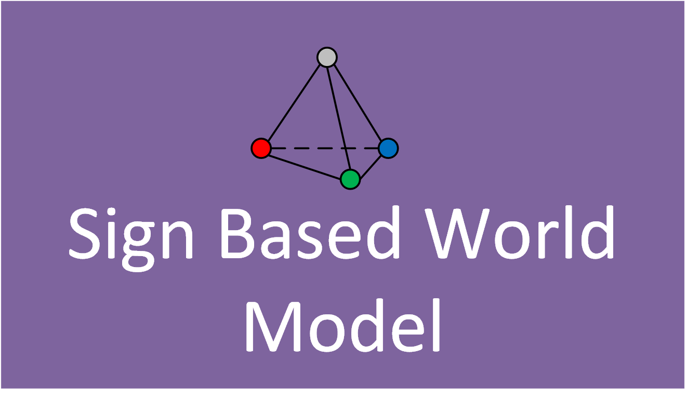

**Sign world model** is a psychologically plausible way 
of representing the knowledge of a cognitive agent. The method was 
developed on the basis of the work of outstanding Soviet and 
Russian psychologists and neurophysiologists. In more detail, 
about a sign world model you can find in:
1. [Signed world view of the subject of behavior.](https://www.rfbr.ru/rffi/ru/books/o_2052004)
2. [Behavior control as a function of consciousness. I. World model and goal setting.](Https://link.springer.com/article/10.1134/S1064230714040121)
3. [Behavior control as a Function of Consciousness. II. Synthesis of a Behavior Plan.](https://www.researchgate.net/publication/284156107_Behavior_Control_as_a_Function_of_Consciousness_II_Synthesis_of_a_Behavior_Plan)
4. [Sign-based Approach to the Task of Role Distribution in the
Coalition of Cognitive Agents.](https://www.researchgate.net/publication/324146839_Sign-based_Approach_to_the_Task_of_Role_Distribution_in_the_Coalition_of_Cognitive_Agents)

**MAPPLANNER** is an open source library that allows building a semiotic network 
of characters based on the input data described in the common formats .pddl and .hddl. 
In addition, the library is simplified implemented the highest 
cognitive function of a person - planning. 
This library implements [case-based planning](https://www.sciencedirect.com/book/9780123220608/case-based-planning) 
and [HTN planning](https://en.wikipedia.org/wiki/Hierarchical_task_network).

## Installation

To install the current release:

```
>>>python3 setup.py sdist
>>>pip3 install .
```

To run the test example:

```
python3 test.py
```
#### Check the correctness of filling the benchmark, according to the basic principles of PDDL 3
The current planner can only work with domain and benchmark described by the following criteria:

#####Domain: 
1. Data types are indicated as a separate field. 
In each action in the column :parameters, the data type of each parameter is indicated.
2. The names of predicates, types, actions, variables must be unique.
3. If in the effect of the action the predicate is not placed in the set of deleted facts, 
then it must be duplicated.
#####Task:
1. Minimum required fields -:objects, :init and :goal.
2. In the goal field, predicates describing the stationary state of the environment should be duplicated.

#### Try your tasks

```python
# task_num - number of the current task. Its needed iff you 
# test basic tasks
task_num = '1' # - string value
# benchmark - a string path to your benchmark. If you don't
# have benchmarks - use basic
benchmark = None 
# backward - its a planning method. Current library can plan 
# forward and backward with classic .pddl tasks
backward = 'True'# - string value
# switch classic and htn planners
task_type = 'pddl'# 'hddl'
```
All feedback you can send to [email](mailto:kiselev@isa.ru)