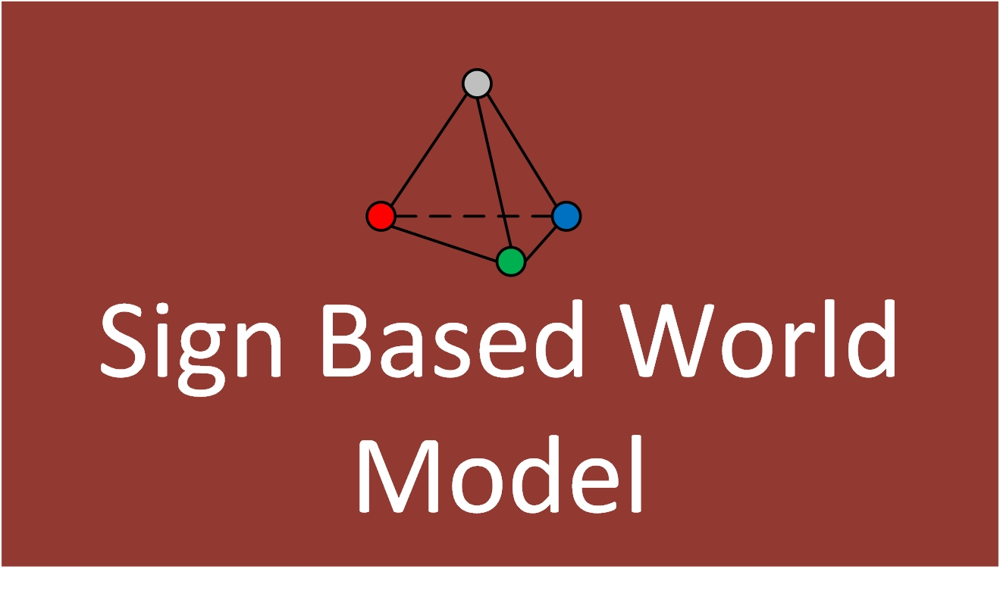

**Spatial planner** is an open source library that allows to synthesize agent's plan 
with use multilevel hierarchical representations of spatial knowledge. The roots of 
this method go to the work of D.A. Pospelov and S. O. Varosyan - Non-metric spatial 
logic (1982).
1. [Spatial reasoning and planning in sign-based world model.](https://link.springer.com/chapter/10.1007/978-3-030-00617-4_1)
2. [Task and Spatial Planning by the Cognitive Agent with Human-like Knowledge Representation](https://www.springerprofessional.de/en/task-and-spatial-planning-by-the-cognitive-agent-with-human-like/16109284)

## Installation
To use this library you need to install map-core.
To install the current release:

```
>>>cd map-planner
>>>git checkout map-spatial
>>>python3 setup.py sdist
>>>pip3 install .
```

To use astar heuristic in path planning:
1. Download C++ compiler.
2. Create a directory "astar" in src directory
3. Build ASearch and copy /release/ASearch.exe to src/astar
4. Create requests directory and responses directory inside benchmark directory


To run the test example:

```
python3 test.py
```

#### Try your tasks

```python
# task_num - number of the current task. Its needed iff you 
# test basic tasks
task_num = '0' # - string value
# benchmark - a string path to your benchmark. If you don't
# have benchmarks - use basic
benchmark = None 
# backward - its a planning method. Current library can plan 
# forward and backward with classic .pddl tasks
backward = 'True'# - string value
# this planner use spatial logic
task_type = 'spatial'
subsearch = 'greedy' # or ASearch

```
All feedback you can send to [email](mailto:kiselev@isa.ru)